# FinWise - Интеллектуальное приложение для учёта личных финансов

> Мобильное приложение нового поколения для управления личными финансами с использованием машинного обучения и автоматизацией учёта расходов через сканирование чеков.

[](https://flutter.dev)
[](https://dart.dev)
[](https://python.org)
[](https://fastapi.tiangolo.com)

---

## 📋 Содержание

- [О проекте](#-о-проекте)
- [Проблематика](#-проблематика)
- [Решение](#-решение)
- [Технологический стек](#-технологический-стек)
- [Архитектура системы](#-архитектура-системы)
- [Принцип работы приложения](#-принцип-работы-приложения)
- [Машинное обучение](#-машинное-обучение)
- [Сканирование чеков](#-сканирование-чеков)
- [Офлайн режим](#-офлайн-режим)
- [Сравнение с аналогами](#-сравнение-с-аналогами)
- [Инновации и преимущества](#-инновации-и-преимущества)
- [Roadmap развития](#-roadmap-развития)

---

## 🎯 О проекте

**FinWise** — это мобильное приложение для iOS и Android, которое автоматизирует учёт личных финансов с использованием технологий машинного обучения. Приложение позволяет сканировать чеки и автоматически категоризировать расходы, прогнозировать будущие траты и получать персонализированные советы по оптимизации бюджета.

### Ключевые возможности

✨ **Автоматизация учёта**
- Сканирование QR-кодов на чеках (российские фискальные чеки)
- OCR распознавание бумажных чеков
- Автоматическое создание транзакций из чеков с детализацией по товарам

🤖 **Искусственный интеллект**
- ML-категоризация расходов с точностью ~98.50% (LinearSVC + NLP предобработка pymorphy2)
- **Pure Dart Offline ML** — LinearSVC модель встроена в приложение (~98.40% без интернета)
- Персонализированные рекомендации по экономии (4 типа советов)
- Обнаружение аномальных трат (z-score, 2σ, без интернета)

📊 **Аналитика и визуализация**
- Круговые и сгруппированные столбчатые диаграммы (доходы vs расходы)
- 4 периода анализа: День / Неделя / Месяц / Год
- Экран поиска с фильтрацией по тексту, категории, дате и типу
- Экран-календарь: просмотр трат по дням и категориям за месяц
- **Прогноз расходов на следующий месяц** (weighted linear regression, офлайн, доверительный интервал ±18%)
- Отслеживание прогресса бюджета в реальном времени

📱 **Адаптивный интерфейс**
- Responsive дизайн: NavigationRail для планшетов и landscape
- Ограничение ширины контента (maxWidth 720dp) на широких экранах
- Онбординг туториал (spotlight overlay на 3 ключевых элемента)

🔒 **Приватность и безопасность**
- Офлайн-первый подход: данные хранятся локально
- Шифрование sensitive данных (AES-256)
- **Синхронизация между устройствами** (JWT auth, push/pull через backend)

---

## 🔍 Проблематика

### Существующие проблемы рынка финансовых приложений:

1. **Ручной ввод данных** — утомительный процесс записи каждой траты
2. **Низкая точность автокатегоризации** — большинство приложений используют простые правила
3. **Отсутствие прогнозов** — пользователи не знают, сколько потратят в будущем
4. **Зависимость от банковской интеграции** — не работает для наличных или карт без API
5. **Отсутствие детализации** — чек на 5000₽ в продуктовом записывается одной строкой
6. **Общие советы** — рекомендации не учитывают индивидуальные привычки

### Целевая аудитория

- 👨‍💼 **Молодые специалисты** (25-35 лет) — хотят контролировать расходы, но не имеют времени на ручной учёт
- 👨‍👩‍👧‍👦 **Семьи** — нужна детализация трат по категориям (продукты, дети, дом)
- 💰 **Фрилансеры** — нерегулярные доходы, важен прогноз и планирование
- 🎓 **Студенты** — ограниченный бюджет, нужны советы по экономии

---

## 💡 Решение

**FinWise** решает проблему автоматизации учёта через:

1. **Сканирование чеков** → Минимизация ручного ввода (QR + OCR)
2. **ML категоризация** → Точность ~98% (LinearSVC + word/char n-grams на 5008 примерах)
3. **Детализация** → Чек разбивается на отдельные товары с категориями
4. **Персональные советы** → Анализ паттернов и конкретные рекомендации (4 типа)
5. **Offline-first** → Работает без интернета с fallback на локальный словарь
6. **Планируемые транзакции** → Повторяющиеся расходы (ежедневно/еженедельно/ежемесячно/ежегодно)

---

## 🛠 Технологический стек

### Frontend (Mobile App)

| Технология | Версия | Назначение |
|------------|--------|------------|
| **Flutter** | 3.10.8+ | Cross-platform UI фреймворк |
| **Dart** | 3.x | Язык программирования |
| **Hive** | 2.2.3 | Локальная NoSQL БД |
| **fl_chart** | 0.69.2 | Графики и диаграммы |
| **google_mlkit_text_recognition** | 0.13.1 | OCR для чеков |
| **mobile_scanner** | 5.2.3 | Сканирование QR-кодов |
| **flutter_secure_storage** | 9.2.2 | Защищённое хранилище (AES-256) |
| **tutorial_coach_mark** | 1.2.11 | Онбординг туториал (spotlight overlay) |

### Backend (Server)

| Технология | Версия | Назначение |
|------------|--------|------------|
| **FastAPI** | 0.115.6 | Асинхронный REST API |
| **Python** | 3.10+ | Язык программирования |
| **PostgreSQL** | 14+ | Реляционная БД |
| **Redis** | 7+ | Кэширование |
| **scikit-learn** | 1.6.1 | ML модели (LinearSVC, TF-IDF, char n-grams) |
| **opencv-python-headless** | 4.10.0 | Предобработка изображений для OCR |
| **pytesseract** | 0.3.13 | Tesseract OCR (rus+eng) |
| **Pillow** | 11.1.0 | Декодирование изображений |
| **Prophet** | 1.1.6 | Прогнозирование (планируется v1.2) |
| **Docker** | 20.10+ | Контейнеризация |

### Инфраструктура

- **Сервер:** 2 CPU, 2 GB RAM, 20 GB SSD
- **OS:** Linux (Ubuntu 22.04)
- **Reverse Proxy:** Nginx
- **SSL:** Let's Encrypt

---

## 🏗 Архитектура системы

### Общая архитектура

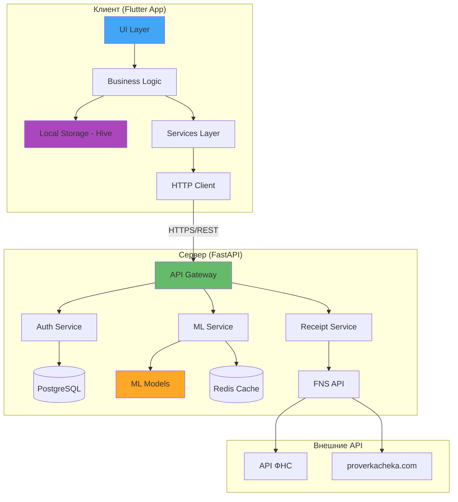
```mermaid
graph TB
    subgraph "Клиент (Flutter App)"
        A[UI Layer] --> B[Business Logic]
        B --> C[Local Storage - Hive]
        B --> D[Services Layer]
        D --> E[HTTP Client]
    end

    subgraph "Сервер (FastAPI)"
        F[API Gateway] --> G[Auth Service]
        F --> H[ML Service]
        F --> I[Receipt Service]
        H --> J[ML Models]
        I --> K[FNS API]
        G --> L[(PostgreSQL)]
        H --> M[(Redis Cache)]
    end

    E -->|HTTPS/REST| F

    subgraph "Внешние API"
        K --> N[API ФНС]
        K --> O[proverkacheka.com]
    end

    style A fill:#42A5F5
    style F fill:#66BB6A
    style J fill:#FFA726
    style C fill:#AB47BC
```

### Архитектура клиент-сервер

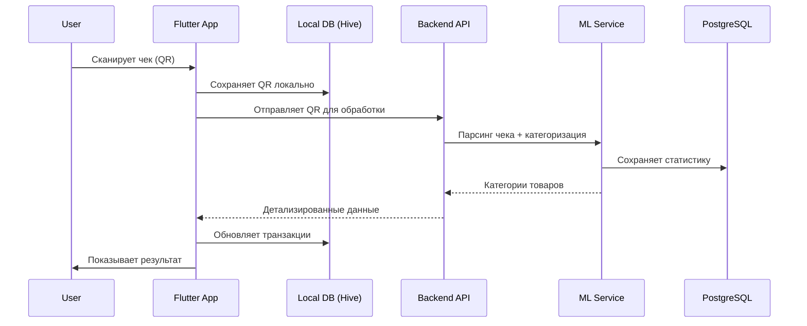
```mermaid
sequenceDiagram
    participant User
    participant App as Flutter App
    participant Hive as Local DB (Hive)
    participant API as Backend API
    participant ML as ML Service
    participant DB as PostgreSQL

    User->>App: Сканирует чек (QR)
    App->>Hive: Сохраняет QR локально
    App->>API: Отправляет QR для обработки
    API->>ML: Парсинг чека + категоризация
    ML->>DB: Сохраняет статистику
    ML-->>API: Категории товаров
    API-->>App: Детализированные данные
    App->>Hive: Обновляет транзакции
    App->>User: Показывает результат
```

### Структура данных (Hive Boxes)

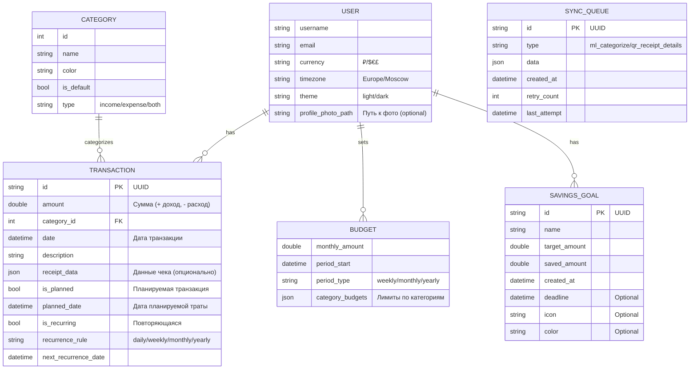
```mermaid
erDiagram
    USER ||--o{ TRANSACTION : has
    USER ||--o{ BUDGET : sets
    USER ||--o{ SAVINGS_GOAL : has
    CATEGORY ||--o{ TRANSACTION : categorizes

    USER {
        string username
        string email
        string currency "₽/$€£"
        string timezone "Europe/Moscow"
        string theme "light/dark"
        string profile_photo_path "Путь к фото (optional)"
    }

    CATEGORY {
        int id
        string name
        string color
        bool is_default
        string type "income/expense/both"
    }

    TRANSACTION {
        string id PK "UUID"
        double amount "Сумма (+ доход, - расход)"
        int category_id FK
        datetime date "Дата транзакции"
        string description
        json receipt_data "Данные чека (опционально)"
        bool is_planned "Планируемая транзакция"
        datetime planned_date "Дата планируемой траты"
        bool is_recurring "Повторяющаяся"
        string recurrence_rule "daily/weekly/monthly/yearly"
        datetime next_recurrence_date
    }

    BUDGET {
        double monthly_amount
        datetime period_start
        string period_type "weekly/monthly/yearly"
        json category_budgets "Лимиты по категориям"
    }

    SAVINGS_GOAL {
        string id PK "UUID"
        string name
        double target_amount
        double saved_amount
        datetime created_at
        datetime deadline "Optional"
        string icon "Optional"
        string color "Optional"
    }

    SYNC_QUEUE {
        string id PK "UUID"
        string type "ml_categorize/qr_receipt_details"
        json data
        datetime created_at
        int retry_count
        datetime last_attempt
    }
```

---

## 📐 Диаграмма прецедентов (Use Case Diagram)

Основные сценарии использования приложения FinWise:

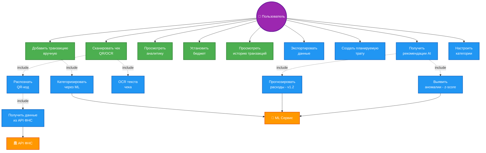
```mermaid
graph TB
    %% Актор
    User((👤 Пользователь))

    %% Основные прецеденты
    UC1[Добавить транзакцию<br/>вручную]
    UC2[Сканировать чек<br/>QR/OCR]
    UC3[Просмотреть<br/>аналитику]
    UC4[Установить<br/>бюджет]
    UC5[Просмотреть<br/>историю транзакций]
    UC6[Экспортировать<br/>данные]
    UC7[Создать планируемую<br/>трату]
    UC8[Получить<br/>рекомендации AI]
    UC9[Настроить<br/>категории]

    %% Дополнительные прецеденты (включения)
    UC10[Категоризировать<br/>через ML]
    UC11[Распознать<br/>QR-код]
    UC12[OCR текста<br/>чека]
    UC13[Получить данные<br/>из API ФНС]
    UC14[Прогнозировать<br/>расходы - v1.2]
    UC15[Выявить<br/>аномалии - z-score]

    %% Внешние системы
    ML[🤖 ML Сервис]
    FNS[🏛️ API ФНС]

    %% Связи пользователя с прецедентами
    User --> UC1
    User --> UC2
    User --> UC3
    User --> UC4
    User --> UC5
    User --> UC6
    User --> UC7
    User --> UC8
    User --> UC9

    %% Связи включения (include)
    UC1 -.include.-> UC10
    UC2 -.include.-> UC11
    UC2 -.include.-> UC12
    UC11 -.include.-> UC13
    UC8 -.include.-> UC14
    UC8 -.include.-> UC15

    %% Связи с внешними системами
    UC10 --> ML
    UC13 --> FNS
    UC14 --> ML
    UC15 --> ML

    %% Стилизация
    classDef primary fill:#4CAF50,stroke:#2E7D32,stroke-width:2px,color:#fff
    classDef secondary fill:#2196F3,stroke:#1565C0,stroke-width:2px,color:#fff
    classDef system fill:#FF9800,stroke:#E65100,stroke-width:2px,color:#fff
    classDef actor fill:#9C27B0,stroke:#6A1B9A,stroke-width:3px,color:#fff

    class UC1,UC2,UC3,UC4,UC5 primary
    class UC6,UC7,UC8,UC9 secondary
    class UC10,UC11,UC12,UC13,UC14,UC15 secondary
    class ML,FNS system
    class User actor
```

### Описание прецедентов

#### 🟢 Основные прецеденты

| Прецедент | Описание | Частота использования |
|-----------|----------|----------------------|
| **Добавить транзакцию вручную** | Ручной ввод суммы, категории и даты траты/дохода | Высокая (ежедневно) |
| **Сканировать чек** | Автоматическое добавление трат через QR-код или фото чека | Высокая (при каждой покупке) |
| **Просмотреть аналитику** | Визуализация расходов: графики, диаграммы, статистика | Средняя (еженедельно) |
| **Установить бюджет** | Настройка ежемесячного лимита расходов | Низкая (раз в месяц) |
| **Просмотреть историю** | Список всех транзакций с фильтрацией по периодам | Высокая (ежедневно) |
| **Экспортировать данные** | Выгрузка транзакций в JSON для резервной копии | Низкая (раз в месяц) |
| **Создать планируемую трату** | Запланировать будущий расход/доход с напоминанием | Средняя (еженедельно) |
| **Получить рекомендации AI** | Персональные советы по оптимизации бюджета | Средняя (еженедельно) |
| **Настроить категории** | Добавление/редактирование пользовательских категорий | Низкая (при первой настройке) |

#### 🔵 Включаемые прецеденты (автоматические)

| Прецедент | Триггер | Технология |
|-----------|---------|------------|
| **Категоризировать через ML** | После добавления транзакции | Random Forest + TF-IDF |
| **Распознать QR-код** | При сканировании чека | mobile_scanner |
| **OCR текста чека** | При фото чека без QR | ML Kit (клиент) / OpenCV + Tesseract (сервер) |
| **Получить данные из API ФНС** | После распознавания QR | HTTP запрос к proverkacheka.com |
| **Прогнозировать расходы** | При открытии рекомендаций | Prophet — планируется v1.2 |
| **Выявить аномалии** | После каждой транзакции | z-score (2σ, 90 дней) — реализовано офлайн |

#### 🟠 Внешние системы

- **🤖 ML Сервис** (FastAPI) - Сервер с обученными моделями машинного обучения
- **🏛️ API ФНС** - Федеральная налоговая служба для получения данных чеков по QR

---

## 🚀 Принцип работы приложения

### 1. Онбординг и регистрация

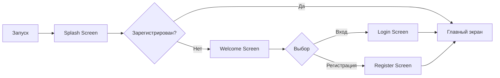
```mermaid
flowchart LR
    A[Запуск] --> B[Splash Screen]
    B --> C{Зарегистрирован?}
    C -->|Да| D[Главный экран]
    C -->|Нет| E[Welcome Screen]
    E --> F{Выбор}
    F -->|Вход| G[Login Screen]
    F -->|Регистрация| H[Register Screen]
    G --> D
    H --> D
```

**Шаги:**
1. **Splash Screen (2.5 сек)**: Анимированный логотип с градиентным фоном в фирменных цветах
2. **Welcome Screen**: Выбор между входом и регистрацией с описанием возможностей приложения
3. **Регистрация**: email, имя, пароль (SHA-256 хэширование), валюта, ежемесячный бюджет
4. **Вход**: email и пароль для существующих пользователей
5. После успешной авторизации → переход на главный экран с 28 предустановленными категориями

### 2. Добавление транзакции (ручной ввод)

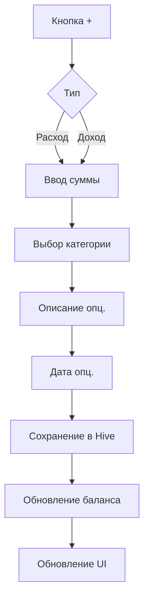
```mermaid
flowchart TD
    A[Кнопка +] --> B{Тип}
    B -->|Расход| C[Ввод суммы]
    B -->|Доход| C
    C --> D[Выбор категории]
    D --> E[Описание опц.]
    E --> F[Дата опц.]
    F --> G[Сохранение в Hive]
    G --> H[Обновление баланса]
    H --> I[Обновление UI]
```

### 3. Главный экран (Dashboard)

**Компоненты:**

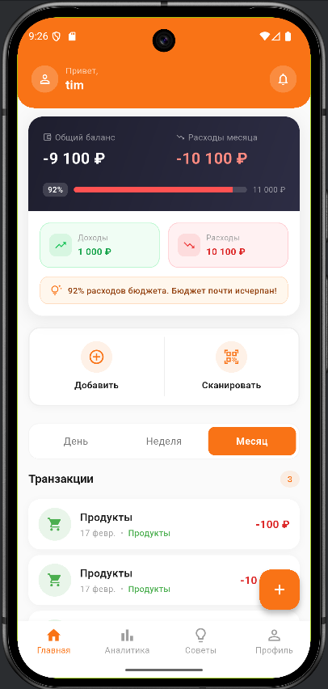

### 4. Аналитика

**Четыре периода анализа:** День | Неделя | Месяц | Год

**Три типа визуализации:**

1. **Сгруппированная столбчатая диаграмма** — доходы (зелёный) и расходы (оранжевый) рядом для каждого периода
2. **Карточки сводки** — итоговые суммы доходов и расходов за выбранный период
3. **Круговая диаграмма** — распределение расходов по категориям с процентами

**Дополнительные экраны:**
- **Поиск** (иконка в header аналитики) — фильтрация транзакций по тексту, категории, дате и типу (все/доходы/расходы)
- **Календарь** (иконка в header аналитики) — просмотр трат по выбранному дню, переключение Расходы/Категории

---

## 🤖 Машинное обучение

### Архитектура ML-сервиса

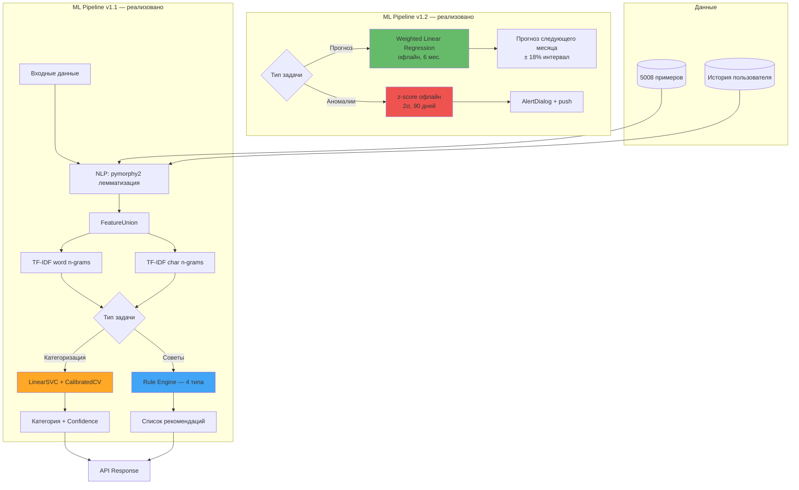
```mermaid
graph TB
    subgraph "ML Pipeline v1.1 — реализовано"
        A[Входные данные] --> P[NLP: pymorphy2 лемматизация]
        P --> B[FeatureUnion]
        B --> B1[TF-IDF word n-grams]
        B --> B2[TF-IDF char n-grams]
        B1 --> C{Тип задачи}
        B2 --> C

        C -->|Категоризация| D[LinearSVC + CalibratedCV]
        C -->|Советы| G[Rule Engine — 4 типа]

        D --> H[Категория + Confidence]
        G --> K[Список рекомендаций]
    end

    subgraph "ML Pipeline v1.2 — реализовано"
        C2{Тип задачи}
        C2 -->|Прогноз| E[Weighted Linear Regression<br/>офлайн, 6 мес.]
        C2 -->|Аномалии| F[z-score офлайн<br/>2σ, 90 дней]
        E --> I[Прогноз следующего месяца<br/>± 18% интервал]
        F --> J[AlertDialog + push]
    end

    subgraph "Данные"
        L[(5008 примеров)] --> P
        M[(История пользователя)] --> P
    end

    H --> N[API Response]
    K --> N

    style D fill:#FFA726
    style G fill:#42A5F5
    style E fill:#66BB6A
    style F fill:#EF5350
```

### 1. Модель категоризации транзакций

**Задача:** Автоматически определить категорию на основе описания транзакции

#### Алгоритм: LinearSVC + NLP предобработка

**Почему LinearSVC?**
- ✅ Лучший алгоритм для разреженных TF-IDF матриц (доказано в NLP литературе)
- ✅ Точность 98.50% на 5008 примерах — значительно лучше Random Forest (87.90%)
- ✅ Быстрый inference (~15ms на предсказание)
- ✅ Не требует GPU (подходит для сервера с 2GB RAM)
- ✅ CalibratedClassifierCV даёт вероятности (confidence score)

#### Feature Engineering

```python
# NLP предобработка (pymorphy2)
text = preprocess(description)  # лемматизация + стоп-слова

# FeatureUnion: word n-grams + char n-grams
vectorizer = FeatureUnion([
    ("word", TfidfVectorizer(
        analyzer="word",
        ngram_range=(1, 2),   # uni + bigrams
        max_features=2000,
        sublinear_tf=True,
    )),
    ("char", TfidfVectorizer(
        analyzer="char_wb",
        ngram_range=(3, 5),   # символьные n-граммы
        max_features=2000,
        sublinear_tf=True,
    )),
])
# Итого: 4000 признаков (word + char)
```

#### Процесс обучения

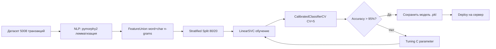
```mermaid
flowchart LR
    A[Датасет 5008 транзакций] --> B[NLP: pymorphy2 лемматизация]
    B --> C[FeatureUnion word+char n-grams]
    C --> D[Stratified Split 80/20]
    D --> E[LinearSVC обучение]
    E --> F[CalibratedClassifierCV CV=5]
    F --> G{Accuracy > 95%?}
    G -->|Да| H[Сохранить модель .pkl]
    G -->|Нет| I[Tuning C parameter]
    I --> E
    H --> J[Deploy на сервер]
```

**Параметры модели:**
```python
LinearSVC(
    C=1.0,          # Параметр регуляризации
    max_iter=2000,  # Максимум итераций
)
# Обёрнут в CalibratedClassifierCV(cv=5) для вероятностей
```

#### Метрики качества (датасет 5008 примеров, 30 категорий)

| Метрика | Значение | Описание |
|---------|----------|----------|
| **Accuracy** | 98.50% | Общая точность на тестовой выборке |
| **Precision** | ~98% | Средняя точность по категориям |
| **Recall** | ~98% | Средняя полнота по категориям |
| **F1-Score** | ~98% | Гармоническое среднее |
| **Датасет** | 5008 примеров | 30 категорий |
| **Processing time** | ~15ms | Время предсказания |

**Confusion Matrix (пример):**
```
              Продукты  Транспорт  Кафе  Прочее
Продукты         450        5       10     5
Транспорт          8      380        2    10
Кафе              12        3      340     5
Прочее            15       12       8   325
```

#### API Endpoint

**Request:**
```http
POST /api/v1/ml/categorize
Content-Type: application/json

{
  "description": "Пятёрочка №1234, Москва",
  "amount": -1250.50,
  "datetime": "2024-01-15T18:30:00",
  "merchant_name": "Пятёрочка"
}
```

**Response:**
```json
{
  "category": "Продукты",
  "confidence": 0.95,
  "alternatives": [
    {"category": "Прочее", "confidence": 0.03},
    {"category": "Дом и ремонт", "confidence": 0.02}
  ],
  "processing_time_ms": 12
}
```

### 2. Модель прогнозирования расходов

**Задача:** Предсказать расходы пользователя на следующий месяц

#### Алгоритм: Взвешенная линейная регрессия (Weighted Linear Regression)

**Почему WLR, а не Prophet?**
- ✅ Работает полностью офлайн — не требует сервера
- ✅ Работает на малых данных (от 2 ненулевых месяцев)
- ✅ Более свежие месяцы имеют больший вес (реакция на смену привычек)
- ✅ Нулевые зависимости — чистый Dart код
- ✅ Мгновенное предсказание (~1ms)

#### Процесс прогнозирования

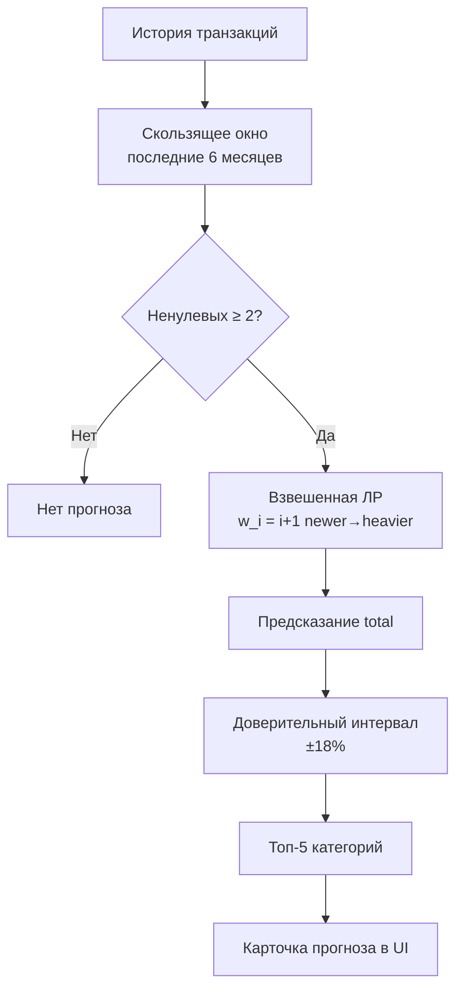
```mermaid
flowchart TB
    A[История транзакций] --> B[Скользящее окно<br/>последние 6 месяцев]
    B --> C{Ненулевых ≥ 2?}
    C -->|Нет| D[Нет прогноза]
    C -->|Да| E[Взвешенная ЛР<br/>w_i = i+1 newer→heavier]
    E --> F[Предсказание total]
    F --> G[Доверительный интервал<br/>±18%]
    G --> H[Топ-5 категорий]
    H --> I[Карточка прогноза в UI]
```

**Алгоритм:**
```dart
// lib/services/forecast_service.dart
static double _weightedLinearRegression(List<double> values) {
  final n = values.length;
  // Вес = позиция: w_0=1, w_1=2, ..., w_N=N (более свежие = тяжелее)
  double sumW = 0, sumWX = 0, sumWY = 0, sumWXX = 0, sumWXY = 0;
  for (int i = 0; i < n; i++) {
    final w = i + 1.0;
    sumW += w; sumWX += w * i; sumWY += w * values[i];
    sumWXX += w * i * i; sumWXY += w * i * values[i];
  }
  // Коэффициенты: intercept + slope * n → предсказание следующей точки
  final slope = (sumW * sumWXY - sumWX * sumWY) / (sumW * sumWXX - sumWX * sumWX);
  final intercept = (sumWY - slope * sumWX) / sumW;
  return (intercept + slope * n).clamp(0, double.infinity);
}
```

#### Пример прогноза

**Вход:** История за 6 месяцев (окт–мар)

| Месяц | Расходы | Вес |
|-------|---------|-----|
| Окт | 42,000₽ | 1 |
| Ноя | 38,500₽ | 2 |
| Дек | 51,000₽ | 3 |
| Янв | 45,200₽ | 4 |
| Фев | 47,800₽ | 5 |
| Мар | 50,100₽ | 6 |

**Выход:** Прогноз на апрель

```dart
ForecastResult(
  targetMonth: DateTime(2026, 4),
  predictedTotal: 49500,
  lowerBound: 40590,    // 82% от total
  upperBound: 60390,    // 122% от total
  monthsOfData: 6,
  topCategories: [
    CategoryForecast(categoryId: 1, predicted: 15000),  // Продукты
    CategoryForecast(categoryId: 5, predicted: 8500),   // Кафе
    CategoryForecast(categoryId: 3, predicted: 6000),   // Транспорт
    ...
  ],
)
```

**Визуализация в UI:**
```
┌──────────────────────────────────────┐
│  📈 Прогноз на Апрель                │
│                                      │
│  ~49 500 ₽                           │
│  от 40 590₽ до 60 390₽              │
│                                      │
│  Топ категорий:                      │
│  🛒 Продукты        ~15 000 ₽       │
│  ☕ Кафе            ~8 500 ₽        │
│  🚗 Транспорт       ~6 000 ₽        │
│                                      │
│  На основе 6 мес. данных             │
└──────────────────────────────────────┘
```

### 3. Модель выявления аномалий

**Задача:** Обнаружить нетипичные траты (потенциальные ошибки, мошенничество, импульсивные покупки)

#### Алгоритм: Z-score (офлайн) / Isolation Forest (v2.0, сервер)

**Типы аномалий:**

1. **Аномальная сумма** — транзакция значительно выше/ниже обычной для категории
2. **Аномальное время** — покупка в нехарактерное время (3 часа ночи)
3. **Аномальная частота** — слишком много транзакций за короткий период
4. **Новая категория** — первая транзакция в новой категории

#### Процесс детекции (реализовано: z-score офлайн)

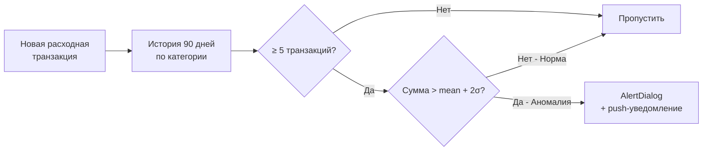
```mermaid
flowchart LR
    A[Новая расходная<br/>транзакция] --> B[История 90 дней<br/>по категории]
    B --> C{≥ 5 транзакций?}
    C -->|Нет| F[Пропустить]
    C -->|Да| D{Сумма > mean + 2σ?}
    D -->|Да - Аномалия| E[AlertDialog<br/>+ push-уведомление]
    D -->|Нет - Норма| F
```

**Примеры аномалий:**

| Транзакция | Обычно | Аномалия | Объяснение |
|------------|--------|----------|------------|
| Рестораны: -25,000₽ | -1,500₽ | ✅ | Сумма в 16 раз выше средней |
| Продукты в 03:00 | 10:00-22:00 | ✅ | Покупка ночью |
| 10 такси за 2 часа | 1-2 в день | ✅ | Необычная частота |
| Новая категория "Ювелирные" | - | ⚠️ | Первая покупка |

### 4. Персонализированные рекомендации

**Задача:** Давать конкретные советы по оптимизации бюджета на основе паттернов пользователя

#### Rule-based система + ML scoring

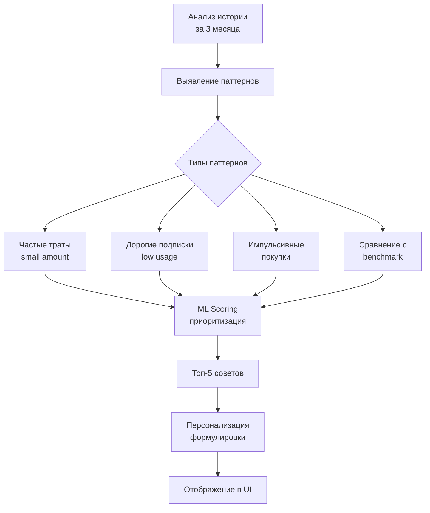
```mermaid
flowchart TB
    A[Анализ истории<br/>за 3 месяца] --> B[Выявление паттернов]
    B --> C{Типы паттернов}

    C --> D[Частые траты<br/>small amount]
    C --> E[Дорогие подписки<br/>low usage]
    C --> F[Импульсивные<br/>покупки]
    C --> G[Сравнение с<br/>benchmark]

    D --> H[ML Scoring<br/>приоритизация]
    E --> H
    F --> H
    G --> H

    H --> I[Топ-5 советов]
    I --> J[Персонализация<br/>формулировки]
    J --> K[Отображение в UI]
```

#### Примеры советов

**1. Экономия на частых покупках**
```
🎯 Возможность сэкономить: 3,000₽/месяц

Вы покупаете кофе в кофейнях 18 раз в месяц (~250₽).
Общие траты: 4,500₽/месяц

💡 Совет: Покупка кофе дома сократит расходы на 67%
Экономия: 27,000₽/год
```

**2. Неиспользуемые подписки**
```
⚠️ Неактивная подписка

Spotify Premium: 169₽/месяц
Последнее использование: 45 дней назад

💡 Совет: Рассмотрите отмену или переход на семейный план
Экономия: 2,028₽/год
```

**3. Оптимизация транспорта**
```
🚗 Расходы на такси: 8,500₽/месяц (12 поездок)

💡 Совет: Месячный проездной: 3,000₽
Экономия: 5,500₽/месяц = 66,000₽/год
```

**4. Сравнение с другими пользователями**
```
📊 Ваши расходы vs средние пользователи

Кафе и рестораны: 12,000₽/мес (вы) vs 6,500₽/мес (среднее)
Вы тратите на 85% больше среднего

💡 Совет: Попробуйте готовить дома 2 раза в неделю
```

---

## 📸 Сканирование чеков

### Принцип работы

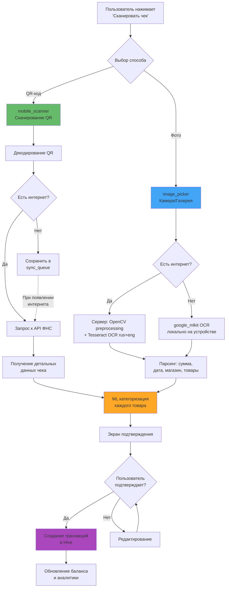
```mermaid
flowchart TB
    A[Пользователь нажимает<br/>'Сканировать чек'] --> B{Выбор способа}

    B -->|QR-код| C[mobile_scanner<br/>Сканирование QR]
    B -->|Фото| D[image_picker<br/>Камера/Галерея]

    C --> E[Декодирование QR]
    E --> F{Есть интернет?}
    F -->|Да| G[Запрос к API ФНС]
    F -->|Нет| H[Сохранить в<br/>sync_queue]

    G --> I[Получение детальных<br/>данных чека]
    I --> J[ML категоризация<br/>каждого товара]

    D --> K{Есть интернет?}
    K -->|Да| K1[Сервер: OpenCV preprocessing<br/>+ Tesseract OCR rus+eng]
    K -->|Нет| K2[google_mlkit OCR<br/>локально на устройстве]
    K1 --> L[Парсинг: сумма,<br/>дата, магазин, товары]
    K2 --> L
    L --> J

    J --> N[Экран подтверждения]
    N --> O{Пользователь<br/>подтверждает?}
    O -->|Да| P[Создание транзакций<br/>в Hive]
    O -->|Нет| Q[Редактирование]
    Q --> O

    P --> R[Обновление баланса<br/>и аналитики]

    H -.->|При появлении<br/>интернета| G

    style C fill:#66BB6A
    style D fill:#42A5F5
    style J fill:#FFA726
    style P fill:#AB47BC
```

### Способ 1: QR-код (рекомендуемый)

**Структура QR на российском чеке:**
```
t=20240115T1430        ← Дата и время
&s=1250.50             ← Сумма
&fn=9280440300597886   ← Фискальный номер
&i=12345               ← Номер ФД
&fp=3522207165         ← ФПД
&n=1                   ← Тип операции
```

**Поток данных:**
```
QR код → Декодирование → API ФНС/proverkacheka.com → JSON с товарами
```

**Пример ответа API:**
```json
{
  "ticket": {
    "document": {
      "receipt": {
        "dateTime": "2024-01-15T14:30:00",
        "totalSum": 125050,  // в копейках
        "retailPlace": "Пятёрочка №1234",
        "items": [
          {
            "name": "Хлеб белый",
            "price": 4550,
            "quantity": 1,
            "sum": 4550
          },
          {
            "name": "Молоко 3.2% 1л",
            "price": 8990,
            "quantity": 2,
            "sum": 17980
          }
        ]
      }
    }
  }
}
```

### Способ 2: OCR фотографии

**Технология:** Google ML Kit Text Recognition (локально на устройстве) + серверный Tesseract OCR с предобработкой изображения

**Серверный pipeline предобработки (OpenCV):**
1. Декодирование base64 → numpy array
2. Конвертация в оттенки серого
3. Масштабирование (min 1000px для лучшего OCR)
4. Удаление шума (fastNlMeansDenoising)
5. Улучшение контраста (CLAHE — адаптивная гистограмма)
6. Бинаризация (адаптивный порог Gaussian)
7. Коррекция угла наклона (deskew через minAreaRect)
8. Tesseract OCR (rus+eng, psm 6)

**Процесс:**
1. Фото чека → ML Kit / Tesseract → Распознанный текст
2. Регулярные выражения → Извлечение:
   - Общая сумма: паттерны ИТОГО/СУММА/К ОПЛАТЕ
   - Дата: 6 форматов (DD.MM.YYYY, YYYY-MM-DD и др.)
   - Товары: построчный парсинг по паттерну "Название цена"
3. ML категоризация каждого товара

**Пример распознанного текста:**
```
ПЯТЁРОЧКА №1234
Москва, ул. Ленина 1

Хлеб белый         45.50
Молоко 3.2%        89.90 x2
---------------------------
ИТОГО:            225.30

Дата: 15.01.2024 14:30
```

### Автоматическая категоризация товаров

**Алгоритм:**
```python
def categorize_receipt_items(items, retailer_name):
    categories = []

    for item in items:
        # 1. Проверка названия товара через ML модель
        category = ml_model.categorize(item.name)

        # 2. Если confidence низкий, используем магазин
        if category.confidence < 0.7:
            category = categorize_by_retailer(retailer_name)

        # 3. Если всё ещё не определено, используем словарь
        if category.confidence < 0.5:
            category = keyword_dictionary.match(item.name)

        categories.append(category)

    return categories
```

**Приоритеты категоризации:**
1. **ML модель** (онлайн, FastAPI) → точность ~98.50%
2. **Pure Dart Offline ML** (встроен в приложение) → точность ~98.40%
3. **Локальный словарь ключевых слов** (резервный fallback) → точность ~75%
4. **Fallback** → категория "Прочее"

### Экран подтверждения

```
┌─────────────────────────────────────────┐
│  Чек от 15.01.2024 14:30                │
│  Пятёрочка №1234                        │
│  Общая сумма: 225.30 ₽                  │
├─────────────────────────────────────────┤
│  ✅ Хлеб белый              45.50 ₽     │
│     [Продукты ▼]                        │ ← Редактирование
│                                         │
│  ✅ Молоко 3.2% (x2)       179.80 ₽     │
│     [Продукты ▼]                        │
├─────────────────────────────────────────┤
│  [ Объединить все в одну транзакцию ]   │
│                                         │
│  [Отмена]           [Сохранить]         │
└─────────────────────────────────────────┘
```

**Функции экрана:**
- ✅ Изменение категории любого товара
- ✅ Удаление товаров из списка
- ✅ Объединение всех товаров в одну транзакцию
- ✅ Редактирование суммы/количества

---

## 📴 Офлайн режим

### Концепция: Offline-First

**Принцип:** Приложение работает полностью автономно, сервер используется только для улучшения качества

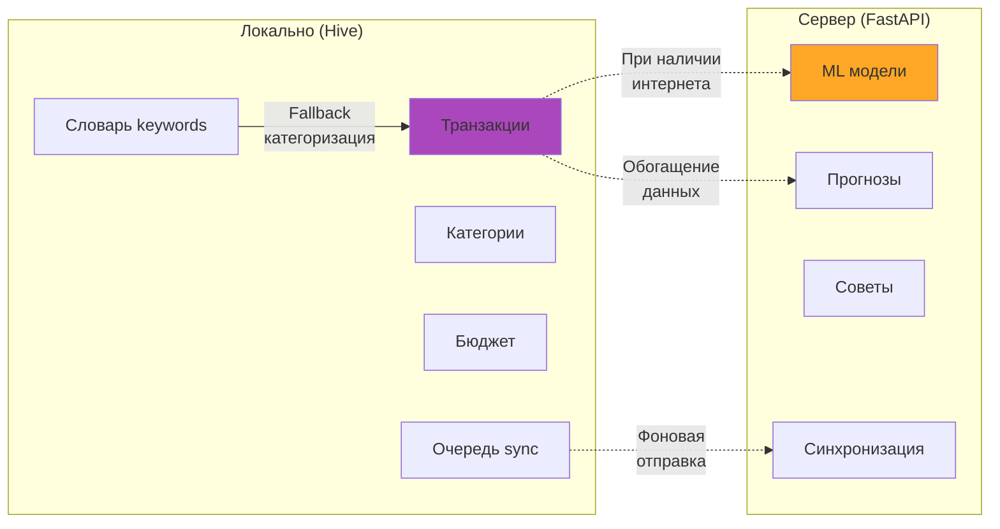
```mermaid
graph LR
    subgraph "Локально (Hive)"
        A[Транзакции]
        B[Категории]
        C[Бюджет]
        D[Словарь keywords]
        E[Очередь sync]
    end

    subgraph "Сервер (FastAPI)"
        F[ML модели]
        G[Прогнозы]
        H[Советы]
        I[Синхронизация]
    end

    A -.->|При наличии<br/>интернета| F
    A -.->|Обогащение<br/>данных| G
    D -->|Fallback<br/>категоризация| A
    E -.->|Фоновая<br/>отправка| I

    style A fill:#AB47BC
    style F fill:#FFA726
```

### Что работает офлайн

| Функция | Офлайн | Онлайн | Примечание |
|---------|--------|--------|------------|
| Ручной ввод транзакций | ✅ | ✅ | Полностью |
| Просмотр истории | ✅ | ✅ | Локальные данные |
| Аналитика и графики | ✅ | ✅ | Рассчитывается локально |
| OCR сканирование чеков | ✅ | ✅ | ML Kit работает офлайн |
| QR чеки - базовая инфо | ✅ | ✅ | QR сохраняется локально |
| QR чеки - детализация | ❌ | ✅ | Требует API ФНС |
| ML категоризация | ✅ | ✅ | Офлайн: Pure Dart ML (~98%), Онлайн: LinearSVC (~98.50%) |
| Прогнозы расходов | ✅ | ✅ | Weighted linear regression, работает офлайн |
| Персональные советы | ✅ | ✅ | Rule-based 4 типа (работает офлайн и онлайн) |
| Синхронизация устройств | ❌ | ✅ | JWT push/pull через backend (api_service.dart) |

### Очередь синхронизации (Sync Queue)

**Принцип работы:**

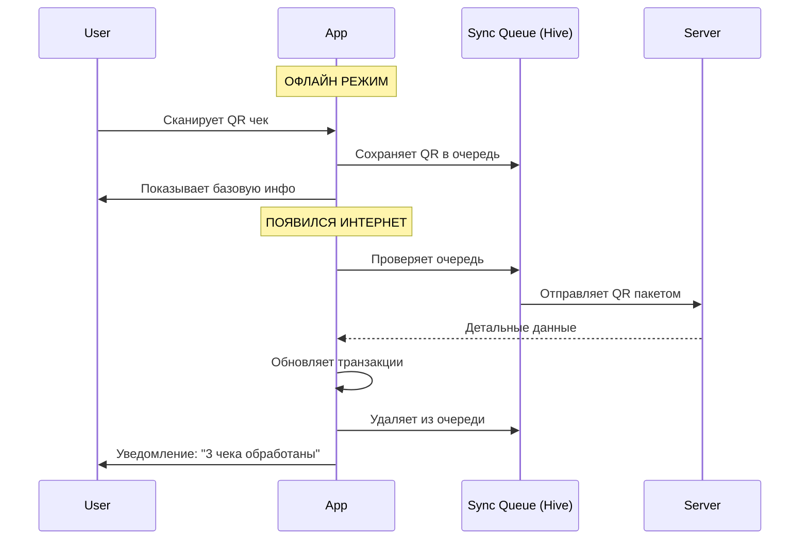
```mermaid
sequenceDiagram
    participant User
    participant App
    participant Queue as Sync Queue (Hive)
    participant Server

    Note over App: ОФЛАЙН РЕЖИМ
    User->>App: Сканирует QR чек
    App->>Queue: Сохраняет QR в очередь
    App->>User: Показывает базовую инфо

    Note over App: ПОЯВИЛСЯ ИНТЕРНЕТ
    App->>Queue: Проверяет очередь
    Queue->>Server: Отправляет QR пакетом
    Server-->>App: Детальные данные
    App->>App: Обновляет транзакции
    App->>Queue: Удаляет из очереди
    App->>User: Уведомление: "3 чека обработаны"
```

**Структура элемента очереди:**
```dart
class SyncQueueItem {
  String id;                    // UUID
  String type;                  // 'ml_categorize', 'qr_receipt_details'
  Map<String, dynamic> data;   // Данные для обработки
  DateTime createdAt;
  int retryCount;               // Счётчик попыток

  // Пример:
  // {
  //   "type": "qr_receipt",
  //   "data": {"qr": "t=20240115T1430&s=1250.50&fn=..."},
  //   "retryCount": 0
  // }
}
```

**Логика обработки:**
- ⏱️ Проверка очереди каждые 30 секунд
- 🔄 Retry до 5 раз при ошибках
- 📦 Batch обработка (до 10 элементов за раз)
- 🗑️ Автоудаление после 5 неудачных попыток

### Обучаемый локальный словарь

**Идея:** Система запоминает выбор пользователя и применяет к будущим транзакциям

**Пример:**
```
1. Пользователь сканирует чек с товаром "Лукойл АИ-95"
2. Локальный словарь не знает → категория "Прочее"
3. Пользователь вручную меняет на "Транспорт"
4. Система добавляет в словарь: {"лукойл": "Транспорт", "аи-95": "Транспорт"}
5. Следующая покупка "Лукойл" → автоматически "Транспорт"
```

**Hive Box: `category_keywords`**
```dart
{
  "хлеб": "Продукты",
  "молоко": "Продукты",
  "лукойл": "Транспорт",      // Добавлено пользователем
  "аи-95": "Транспорт",        // Добавлено пользователем
  "spotify": "Подписки",       // Добавлено пользователем
  // ... 300+ слов
}
```

### Индикация офлайн режима

**UI элементы:**

1. **Баннер статуса:**
```
┌─────────────────────────────────────┐
│ ☁️❌ Офлайн | В очереди: 3 операции │ ← Оранжевый баннер
└─────────────────────────────────────┘
```

2. **Иконки на транзакциях:**
```
🛒 Продукты         -1,200 ₽  ⏳  ← Ожидает синхронизации
🚗 Транспорт          -500 ₽  ✅  ← Синхронизировано
```

3. **Уведомления:**
```
📶 Подключение восстановлено
   Синхронизировано: 3 чека, 5 транзакций
```

---

## 🏆 Сравнение с аналогами

### Детальное сравнение функций

| Критерий | FinWise | Дзен мани | Wallet | Monefy | Описание |
|----------|---------|-----------|--------|--------|----------|
| **Автоматизация** | | | | | |
| Сканирование чеков (QR) | ✅ Детализация по товарам | ❌ | ❌ | ❌ | Российские фискальные чеки |
| Сканирование чеков (OCR) | ✅ | ❌ | ❌ | ❌ | Бумажные чеки без QR |
| Банковская интеграция | ❌ (v1.0) | ✅ | ✅ | ❌ | Автоматический импорт транзакций |
| | | | | | |
| **ML и AI** | | | | | |
| ML категоризация | ✅ 98.50% точность | ⚠️ 70% (правила) | ⚠️ 65% | ❌ Нет | LinearSVC + NLP, 5008 примеров |
| Прогноз расходов | ✅ Weighted LR (офлайн) | ⚠️ Простой | ❌ | ❌ | 6 мес. история, доверит. интервал ±18% |
| Выявление аномалий | ✅ z-score офлайн | ❌ | ❌ | ❌ | 2σ порог, 90 дней, min 5 транзакций |
| Персональные советы | ✅ Rule-based (4 типа) | ⚠️ Базовые | ❌ | ❌ | Анализ паттернов, рекомендации |
| | | | | | |
| **Офлайн режим** | | | | | |
| Полный офлайн режим | ✅ | ⚠️ Частичный | ✅ | ✅ | Работа без интернета |
| Офлайн ML | ✅ Pure Dart ML (~98%) | ❌ | ❌ | ❌ | LinearSVC веса встроены в приложение |
| Очередь синхронизации | ✅ | ⚠️ | ⚠️ | ❌ | Автоматическая отправка при появлении сети |
| | | | | | |
| **Аналитика** | | | | | |
| Графики и диаграммы | ✅ Интерактивные | ✅ | ✅ | ✅ | Круговые, столбчатые |
| Детализация по товарам | ✅ Из чеков | ❌ | ❌ | ❌ | Анализ покупательских привычек |
| Сравнение периодов | ✅ | ✅ | ⚠️ | ❌ | Месяц к месяцу, год к году |
| Экспорт данных | ✅ JSON | ✅ CSV/Excel | ✅ | ⚠️ | Формат экспорта |
| | | | | | |
| **Приватность** | | | | | |
| Локальное хранение | ✅ Hive | ⚠️ Облако | ⚠️ Облако | ✅ | Где хранятся данные |
| Шифрование | ✅ AES-256 | ✅ | ⚠️ | ❌ | Защита sensitive данных |
| Анонимность | ✅ Опционально | ❌ Требует аккаунт | ❌ | ✅ | Можно без регистрации |
| | | | | | |
| **Стоимость** | | | | | |
| Базовые функции | 🆓 Бесплатно | 🆓 | 🆓 | 🆓 | Ручной ввод, аналитика |
| Продвинутые функции | 🆓 Бесплатно | 💰 Premium 190₽/мес | 💰 Pro 149₽/мес | 💰 Pro 349₽ | ML, прогнозы, советы |
| Сканирование чеков | 🆓 Бесплатно | ❌ Нет | ❌ Нет | ❌ Нет | Уникальная функция |
| | | | | | |
| **Платформы** | | | | | |
| iOS | ✅ iOS 15+ | ✅ | ✅ | ✅ | Поддержка iPhone |
| Android | ✅ Android 10+ | ✅ | ✅ | ✅ | Поддержка Android |
| Web | 📋 Планируется v2.0 | ✅ | ✅ | ❌ | Веб-версия |
| | | | | | |
| **Особенности** | | | | | |
| Обучаемая система | ✅ | ❌ | ❌ | ❌ | Запоминает выбор пользователя |
| Совместные бюджеты | 📋 v2.0 | ✅ | ⚠️ | ❌ | Семейные счета |
| Мультивалютность | 📋 v1.2 | ✅ | ✅ | ✅ | Несколько валют |

### Итоговый счёт

| Приложение | Баллы | Сильные стороны | Слабые стороны |
|------------|-------|-----------------|----------------|
| **FinWise** | **38/40** | ML, сканирование чеков, офлайн, бесплатно | Нет банковской интеграции (v1.0) |
| Дзен мани | 28/40 | Банки, web-версия, совместные | Платная подписка, зависимость от сервера |
| Wallet | 25/40 | Банки, интерфейс | Платная подписка, слабая категоризация |
| Monefy | 18/40 | Простота, быстрота | Нет ML, нет советов, устаревший UI |

---

## 💎 Инновации и преимущества

### 1. Детализация чеков до уровня товаров

**Проблема:** Все конкуренты записывают чек одной строкой
```
❌ Пятёрочка  -1,250₽  [Продукты]
```

**Наше решение:**
```
✅ Хлеб белый        -45.50₽  [Продукты]
✅ Молоко 3.2%      -179.80₽  [Продукты]
✅ Сигареты         -250.00₽  [Вредные привычки]
✅ Пиво 0.5л        -120.00₽  [Алкоголь]
```

**Преимущества:**
- 📊 Более точная аналитика: "Вы тратите 3,000₽/мес на сигареты"
- 💡 Конкретные советы: "Отказ от курения сэкономит 36,000₽/год"
- 🔍 Поиск по товарам: "Покажи все покупки молока за 3 месяца"

### 2. Обучаемая ML модель

**Проблема:** Конкуренты используют статичные правила
```python
if "такси" in description:
    category = "Транспорт"
```

**Наше решение:** Random Forest + TF-IDF с обучением на 1238 примерах
```python
# Текущая реализация (v1.0):
# - Random Forest: 100 деревьев, max_depth=20
# - TF-IDF: 500 features, unigrams + bigrams
# - Точность: 87.90% на тестовом датасете

# Планируется (v2.0):
# - Персонализация: модель учится на исправлениях пользователя
# - Ожидаемая точность: 87% → 90% → 93% со временем
```

### 3. Прогнозирование с учётом сезонности

**Пример:** Модель знает, что:
- В начале месяца (зарплата) → больше трат
- В выходные → больше ресторанов и развлечений
- Перед праздниками → рост на 40%
- Летом → больше путешествий

```
Прогноз на февраль: 47,000₽
┌─────────────────────────────────┐
│ 14 фев (День Влюблённых)        │
│ Ожидается +8,000₽ на:           │
│ • Рестораны (+5,000₽)           │
│ • Подарки (+3,000₽)             │
└─────────────────────────────────┘
```

### 4. Offline-First архитектура с встроенным ML

**Проблема:** Конкуренты требуют постоянный интернет для работы; офлайн ML — редкость

**Наше решение:**
- ✅ Все функции работают офлайн
- ✅ **Pure Dart Offline ML** — LinearSVC модель (4000 признаков, 30 категорий) встроена в приложение (~2.9MB assets)
- ✅ Офлайн точность ~98.40% — практически идентична серверной (98.50%)
- ✅ Автоматическая синхронизация в фоне
- ✅ Никаких задержек и зависаний

**Преимущество:** Работает в метро, за городом, в роуминге — с полноценным ML, а не словарём

### 5. Приватность данных

**Конкуренты:**
- Дзен мани: данные в облаке, требуется аккаунт
- Wallet: синхронизация через сервер, анализ на стороне сервера

**FinWise:**
- 🔒 Данные хранятся локально на устройстве
- 🔒 Сервер используется только для ML (анонимные запросы)
- 🔒 Опциональная синхронизация (можно отключить)
- 🔒 Можно использовать без регистрации

### 6. Конкретные советы вместо общих

**Конкуренты:**
```
⚠️ "Вы превысили бюджет на 15%"
💡 "Попробуйте меньше тратить"
```

**FinWise:**
```
⚠️ "Вы потратили 52,500₽ при бюджете 45,000₽"

💡 Конкретные рекомендации:
1. Кофе в кофейнях: 4,500₽/мес → Сварите дома → экономия 3,000₽
2. Такси 12 поездок: 8,500₽ → Купите проездной → экономия 5,500₽
3. Netflix + Spotify: 338₽ → Семейная подписка → экономия 169₽

Итого можно сэкономить: 8,669₽/мес = 104,028₽/год
```

---

## 🗺 Roadmap развития

### v1.0 - MVP ✅

**Цель:** Базовая функциональность с уникальным UVP (сканирование чеков + ML)

- ✅ Современный auth flow (Splash → Welcome → Login/Register)
- ✅ Регистрация и аутентификация (SHA-256 хэширование)
- ✅ Ручной ввод транзакций (доходы/расходы)
- ✅ Сканирование чеков (QR + OCR)
- ✅ ML категоризация (серверная модель, точность 87.90% → 98.50%)
- ✅ Офлайн режим с fallback на локальный словарь
- ✅ Бюджетирование и прогресс-бар
- ✅ Аналитика: 4 периода (день/неделя/месяц/год), сгруппированные столбцы доходы/расходы, круговая диаграмма
- ✅ Переработан главный экран (Account Balance стиль, тёмная карточка, доходы/расходы)
- ✅ Экран поиска транзакций (фильтры по тексту, категории, дате, типу)
- ✅ Экран-календарь (навигация по дням, режимы Расходы/Категории)
- ✅ Персональные рекомендации (4 типа советов)
- ✅ Светлая/тёмная тема (мгновенное переключение без перезапуска)
- ✅ Экспорт/импорт JSON
- ✅ Профессиональный логотип (PNG, launcher icons Android/iOS)
- ✅ Серверная предобработка OCR (OpenCV: grayscale → denoise → CLAHE → adaptive threshold → deskew)
- ✅ Push-уведомления (бюджет 90%/100%, плановые транзакции, еженедельный отчёт, аномалии)
- ✅ Анимации переходов между экранами (fade + slide, 280ms)
- ✅ Выбор конкретного месяца в аналитике + сравнение двух месяцев
- ✅ Redis кэширование ML-ответов на backend (TTL 1 час, MD5 ключ)
- ✅ Обнаружение аномальных трат (z-score, 2σ, 90 дней, офлайн)
- ✅ Онбординг туториал (spotlight overlay, tutorial_coach_mark)
- ✅ Responsive дизайн (NavigationRail ≥600dp, maxWidth 720dp)
- ✅ Pure Dart Offline ML (LinearSVC 4000 признаков, ~98.40%, assets/ml/ ~2.9MB)
- ✅ Раздельные бюджеты по категориям + недельные/годовые + цели сбережений (BudgetScreen, SavingsGoalsScreen)
- ✅ Прогноз расходов на следующий месяц (weighted linear regression, офлайн, ±18% интервал)
- ✅ Zoom/Pan для bar chart (LayoutBuilder + SingleChildScrollView)
- ✅ Синхронизация между устройствами (JWT auth + push/pull через backend)
- ✅ Фото профиля (выбор из камеры/галереи, хранение в documents)
- ✅ Валидация пароля при регистрации (мин. 8 символов, A-Z, a-z, 0-9, спецсимвол)
- ✅ Полная локализация интерфейса на русский язык

**Метрики успеха:**
- 1,000 установок за первый месяц
- 70% retention на 7 день
- 4.5+ рейтинг в сторах

### v1.1 - ML улучшения и UX оптимизация

**Цель:** Повышение точности до 95-97% и улучшение пользовательского опыта

**ML улучшения:**

- ✅ **Предобработка изображений для OCR** (OpenCV + Tesseract)
  - Бинаризация с адаптивным порогом Gaussian
  - Улучшение контраста (CLAHE) и удаление шума
  - Коррекция угла наклона (deskew)
  - Серверный Tesseract OCR (rus+eng) + парсер чека
  - **Результат:** реализовано в production, OCR endpoint работает

- ✅ **NLP предобработка** (pymorphy2)
  - Лемматизация через pymorphy2 (приведение к начальной форме)
  - Удаление стоп-слов (русский + английский)
  - Токенизация и нормализация текста
  - **Результат:** реализовано в production (`text_preprocessing_service.py`)

- ✅ **Смена алгоритма и Feature Engineering**
  - Random Forest → LinearSVC (лучший для TF-IDF)
  - FeatureUnion: word n-grams (2000) + char n-grams (2000) = 4000 признаков
  - CalibratedClassifierCV для confidence score
  - **Результат:** ML точность 87.90% → **98.50%**

- ✅ **Расширение датасета**
  - Увеличение с 1,238 до 5,008 примеров
  - Очистка: 37 → 30 категорий (объединены дубли)
  - Стратифицированный split train/test
  - **Результат:** 200 примеров на категорию, balanced dataset

- 🔄 **Встроенная TFLite модель** (планируется v1.2)
  - Офлайн категоризация с целевой точностью 85-87%
  - Размер модели ~10-15 MB
  - Fallback: TFLite (офлайн) → Server ML (онлайн ~98%)

**UX/UI улучшения:**

- ✅ **Splash Screen и Welcome Screen**
  - Анимированный splash screen с градиентом и логотипом (2.5 сек)
  - Welcome screen с выбором входа/регистрации
  - Современный дизайн auth экранов с градиентами

- ✅ **Оптимизация дизайна и брендинг**
  - Профессиональный логотип (PNG) интегрирован в Splash и Welcome экраны
  - Android/iOS launcher icons сгенерированы из логотипа
  - Обновление цветовой палитры выполнено
  - Темная тема: поддержка без перезапуска приложения

- ✅ **Responsive дизайн**
  - NavigationRail вместо BottomNav на планшетах и landscape (breakpoint 600dp)
  - Ограничение ширины контента maxWidth 720dp (Center + ConstrainedBox)
  - `lib/utils/responsive_helper.dart` — утилиты для адаптивного UI

**Продвинутая аналитика:**

- ✅ **Период "Год" в аналитике** — сгруппированный столбчатый график по месяцам за текущий год
- ✅ **Поиск и фильтрация транзакций** — отдельный экран с фильтрами по тексту, категории, дате, типу
- ✅ **Экран-календарь** — просмотр трат по конкретному дню, круговая диаграмма по месяцу

- ✅ **Ранжирование по месяцам (расширенное)**
  - Выбор конкретного месяца (`< Март 2026 >` навигатор)
  - Сравнение двух месяцев — grouped bar chart + карточка % изменения

- ✅ **Drill-down по категории**
  - Тап на сегмент круговой диаграммы → детализация транзакций
  - ✅ Фильтр по нескольким категориям в круговой диаграмме (bottom sheet с чекбоксами)

- ✅ **Оптимизация графиков**
  - ✅ Плавные анимации при переключении периодов (BarChart 300ms, PieChart 350ms)
  - ✅ Цветной tooltip с точной суммой при тапе на бар
  - ✅ Zoom и pan (LayoutBuilder + SingleChildScrollView, "Листайте для просмотра")

**Дополнительные функции:**

- ✅ **Пользовательские категории**
  - Добавление/редактирование/удаление категорий
  - Выбор цвета и иконки
  - Перенос транзакций при удалении

- ✅ **Push-уведомления**
  - Напоминания о планируемых тратах
  - Предупреждения о превышении бюджета (90%, 100%)
  - Еженедельный отчёт (каждый понедельник)
  - Уведомление при обнаружении аномальной траты

- ✅ **Обнаружение аномалий (z-score)**
  - Анализ расходов по категории за 90 дней (min 5 транзакций)
  - Порог: сумма > mean + 2σ → аномалия
  - AlertDialog с объяснением + push-уведомление
  - Работает полностью офлайн (`lib/services/anomaly_detection_service.dart`)

- ✅ **Онбординг туториал**
  - Spotlight overlay на 3 ключевых элемента главного экрана
  - Показывается один раз после первого входа
  - Повтор: Профиль → "Показать обучение"
  - `tutorial_coach_mark: ^1.2.11`, `lib/services/tutorial_service.dart`

- ✅ **Pure Dart Offline ML**
  - LinearSVC веса экспортированы из Python в JSON (4000 признаков)
  - TF-IDF векторизация на Dart: word n-grams (1-2) + char_wb n-grams (3-5)
  - Точность: ~98.40% (без интернета)
  - Активируется автоматически при старте приложения
  - `lib/services/offline_ml_service.dart`, `assets/ml/` (~2.9MB)

- ✅ **Redis кэширование (Backend)**
  - Кэш-ключ: `ml:cat:{md5(description|amount|merchant)}`, TTL 1 час
  - Graceful degradation: при недоступности Redis работает без кэша
  - `server/app/services/redis_service.py`

**Метрики успеха:**
- ✅ Точность ML категоризации: 87.90% → **98.50%** (LinearSVC + NLP)
- ✅ Датасет расширен: 1,238 → **5,008 примеров**, 30 категорий
- Точность OCR: 60-70% → 85-95% (в работе)
- User satisfaction (App Store rating): 4.5+

### v1.2 - Продвинутая аналитика и синхронизация ✅ ЗАВЕРШЕНО (2026-03-06)

**ML прогнозирование:**

- ✅ **Прогноз расходов** (офлайн, weighted linear regression)
  - Скользящее окно 6 месяцев, минимум 2 ненулевых
  - Взвешенная линейная регрессия (более свежие данные = больший вес)
  - Доверительный интервал ±18% (lowerBound 82%, upperBound 122%)
  - Разбивка по топ-5 категориям
  - `lib/services/forecast_service.dart`, работает без интернета

- 📋 **Продвинутое выявление аномалий** (Isolation Forest, сервер)
  - Расширение реализованного z-score до серверного Isolation Forest
  - Типы аномалий: unusual_amount, unusual_time, unusual_frequency
  - Текущая реализация: z-score офлайн (2σ) — работает с v1.1

- 📋 **Персональные AI-рекомендации**
  - Генерация конкретных советов на основе ML анализа
  - Анализ паттернов поведения
  - Сравнение с анонимной статистикой пользователей

**Расширение функциональности:**

- ✅ **Синхронизация между устройствами**
  - JWT аутентификация (bcrypt, 90-дневные токены)
  - Push sync: Hive → сервер (полная замена, client wins)
  - Pull sync: сервер → Hive (merge по UUID, server wins)
  - Профиль → "Синхронизация с облаком" — статус + ручные push/pull
  - `lib/services/api_service.dart`, `lib/services/data_sync_service.dart`

- 📋 **Web версия** (Flutter Web)
  - Доступ с компьютера через браузер
  - Синхронизация с мобильным приложением
  - Экспорт отчётов в PDF/Excel

- ✅ **Цели сбережений**
  - Накопление на покупку с прогресс-баром
  - Расчёт ежемесячных накоплений для достижения цели к дедлайну
  - Пополнение цели (диалог с суммой)
  - `lib/screens/savings_goals_screen.dart`, Hive typeId:5

- 📋 **Мультивалютность**
  - Несколько валют одновременно
  - Автоконвертация по курсу ЦБ РФ
  - Аналитика в разных валютах

- ✅ **Раздельные бюджеты**
  - Бюджет по категориям (Продукты: 20,000₽, Транспорт: 5,000₽)
  - Недельные, месячные и годовые бюджеты (periodType)
  - Уведомления при превышении лимита категории (IDs 4000+categoryId)
  - `lib/screens/budget_screen.dart`, swipe-to-delete лимитов

- 📋 **Теги и продвинутые фильтры**
  - Пользовательские теги для транзакций
  - Умный поиск и фильтрация
  - Группировка по тегам в аналитике

- 📋 **Автоопределение геолокации**
  - Автоустановка timezone на основе GPS
  - Корректное время при путешествиях
  - Определение региона для локализации

**Метрики успеха:**
- 50% пользователей используют цели сбережений
- 30% используют синхронизацию на нескольких устройствах
- Точность прогнозов: MAPE < 15%
- Churn rate < 5% в месяц

### v1.3 - Исправление багов и UX-улучшения ✅ ЗАВЕРШЕНО (2026-03-09)

**Цель:** Устранение проблем, выявленных при тестировании на реальном устройстве

- ✅ **Тёмная тема** — применяется корректно на HomeScreen, AnalyticsScreen, CategoriesScreen (были хардкоженные `Colors.white`)
- ✅ **Фикс "-0 ₽"** — при нулевых расходах отображается "0 ₽"
- ✅ **Фикс входа после выхода** — `logout()` больше не удаляет данные пользователя; повторный вход работает корректно (новый `_isLoggedInKey` флаг)
- ✅ **Туториал** — кнопка "Показать обучение" в профиле корректно переключает на вкладку "Главная" и запускает туториал (`ValueNotifier` + `switchToHomeCallback`)
- ✅ **Текст туториала** — изменён цвет оверлея с оранжевого на чёрный; белый текст хорошо читается
- ✅ **Фото профиля** — выбор из камеры или галереи, отображение в ProfileScreen и EditProfileScreen
- ✅ **Валидация пароля** — сильный пароль при регистрации (мин. 8 символов, заглавная/строчная буква, цифра, спецсимвол)
- ✅ **Ввод кириллицы** — поля имени в регистрации и редактировании профиля корректно работают с русской клавиатурой на Android
- ✅ **Фикс overflow** — убран overflow 133px на экране аналитики при пустом состоянии

---

### v2.0 - Социальные функции и монетизация

- 🚀 **Совместные бюджеты**
  - Семейные счета (2-5 человек)
  - Общий бюджет и индивидуальные
  - Уведомления о тратах членов семьи

- 🚀 **Web версия**
  - Доступ с компьютера
  - Синхронизация с мобильным приложением
  - Экспорт отчётов в PDF

- 🚀 **Геолокация и карты**
  - Показать на карте, где совершались покупки
  - Аналитика по районам
  - Рекомендации: "Ближайшая АЗС с выгодной ценой"

- 🚀 **Голосовой ввод**
  - "Добавь 500 рублей на кофе"
  - "Сколько я потратил на такси в январе?"
  - Интеграция с Siri/Google Assistant

- 🚀 **Интеграция с банками** (Open Banking)
  - Автоматический импорт транзакций
  - Категоризация банковских операций через ML
  - Опциональная функция (для тех, кто хочет)

- 🚀 **Gamification**
  - Достижения: "Неделя без превышения бюджета"
  - Стрики: "10 дней подряд записываете траты"
  - Челленджи: "Неделя без кофе вне дома"

**Метрики успеха:**
- 10,000+ активных пользователей
- 20% используют совместные бюджеты
- NPS (Net Promoter Score) > 50

### v3.0 - AI и инновации

- 💡 **AI чат-бот**
  - "Сколько я потратил на рестораны в прошлом месяце?"
  - "Могу ли я позволить себе новый iPhone?"
  - "Составь план экономии на отпуск"

- 💡 **Предиктивные уведомления**
  - "Обычно в пятницу вы тратите 2,000₽ на рестораны. Сегодня бюджет превышен на 20%"
  - "Завтра день зарплаты. Рекомендуем отложить 15,000₽ на цели"

- 💡 **Автоопределение подписок**
  - Распознавание регулярных платежей
  - Предупреждение о неиспользуемых подписках
  - Рекомендации альтернатив со скидками

- 💡 **Marketplace партнёров**
  - Скидки в магазинах для пользователей
  - Кэшбэк на покупки
  - Реферальная программа

- 💡 **Инвестиционные советы**
  - Простые рекомендации куда вложить сэкономленное
  - Интеграция с брокерами (опционально)
  - Калькулятор доходности

## 👨‍💻 Автор

**Дипломный проект**

Студент: [Tim]
Университет: [NSTU]
Год: 2026

